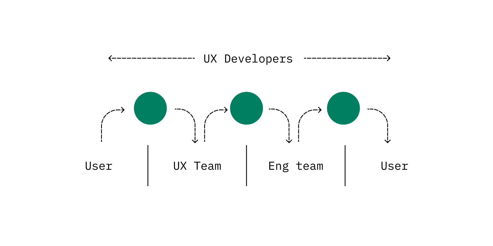

In 2015 I lived at my parents' house in [Canberra, Australia](https://www.google.com/maps/place/Canberra+ACT,+Australia/). Only having 50kb/s internet speed available meant uploading a photo would crash the connection for everyone else.

For people living in rural Australia, and many places around the world, this is a common scenario. While working for the Australian Government, I heard stories of farmers having to walk up a hill to throw their phone into the air. Each throw downloaded more of the user interface. They would throw their phone until they were able to finish their task. This was easier than driving five hours to the closest town.

Pixels create user interfaces. Code determines the position, interaction, movement, and performance of these pixels. Code is the bridge between pixels and people.

Yet, the connection between pixels and people is complicated.

---

For many years engineering teams were considered the builders of these pixels. They would partner with user experience (UX) teams who would design the pixels.
The design process consists of UX teams working with the user - these teams understand the user's journey and exercise empathy when they create prototypes or high-fidelity designs. During creation of these designs and prototypes, UX teams try to understand technical limitations and implementation challenges. Technical limitations can be hard to understand, while implementing designs can create tension when considering performance bottlenecks or technical debt.

When engineering teams build from the prototypes and high-fidelity designs, they only have part of the understanding. Design does not stop when building starts. Engineers make decisions on performance, bundle size, and interaction with each line of code written. This disconnect increases the risk for assumptions, which affect the quality of the product and experience for our users.

The UX and engineering teams are not a part of each other's process. These teams struggle to speak the same language, and handover slows each team's understanding, making it harder to challenge the other.

UX developers bridge this gap.

---

## So what is a UX developer?

The UX developer role at Shopify has existed since 2018. It isn't limited to front end development, web development, or a designer who can code.

The first reference I saw to the role UX developer was in a post by [@leisa](https://twitter.com/leisa) in 2012, titled ["What is a User Experience Developer and are they really a thing?"](http://www.disambiguity.com/what-is-a-ux-developer/). In the post she explains that UX is a continuum.

> "There are different layers of user experience - these layers sit on a continuum between the pixel and the person."

UX developers are a part of the whole UX continuum from the pixel to the person. They bring engineering knowledge and context to the UX team so designers can make well-informed design decisions. They also bring empathy for the user and deep problem-space understanding to the engineering team so developers can make well-informed engineering decisions. This creates a strong connection between people and pixels.

UX developers work with stakeholders, designers, fellow engineers, content strategists, and researchers. They collaborate throughout the ideation, exploration, and build phases of project work. They take part in research sessions and write production code.

Through their craft they use different tools and materials. They sketch with pen and paper, use design tools like Figma, and prototyping tools like Principle - or they may use code as their design tool of choice.

They write production code with a focus on the user's experience. They craft interaction patterns that are reusable, inclusive, and performant.

UX developers care about reducing the number of times somebody has to throw their phone into the air, or preventing it altogether. They try to gain a perspective of the problem from day one, walking up the hill with the farmer. They craft ideas with the UX team to direct the solution. Then, they work with the engineering team to share their perspective and create the desired experience in production.

---

## Where can we go?

A web designer, front end developer, web developer, or design technologist also may care about bridging the gap between pixels and people.

While this is true, a dedicated UX developer role allows people to specialize in front end development skills that directly relate to a user's experience on the page. They can dive deep into accessibility, performance, interactions, and front end frameworks while still participating in research, ideation, and exploration. Our experience at Shopify is that projects that have this role consistently produce higher quality and align to the needs of our users.

UX developers at Shopify connect pixels to the people that use our products.

---

**Is this you?** Are you someone who writes code but also participates heavily in thinking and talking about the user experience? Do you love the intersection of code and design?

Shopify is hiring UX developers. If this article reflects the work you do, or this is where you want to grow as a developer, please [apply today](https://www.shopify.com/careers/search?keywords=UX%20Dev).

At Shopify we value different opinions and make space for people to be included, valued, and heard. We are a team of constant learners with unique ideas, ambitions, and skill sets.

---

This blog post was a collaborative effort that would not have been possible without [Koen](https://twitter.com/kvendrik), [Gene](https://medium.com/@gene_shannon), [Dom](https://twitter.com/dfmcphee) and the UX developers and [other UXers](https://twitter.com/ShopifyUX) at Shopify.
